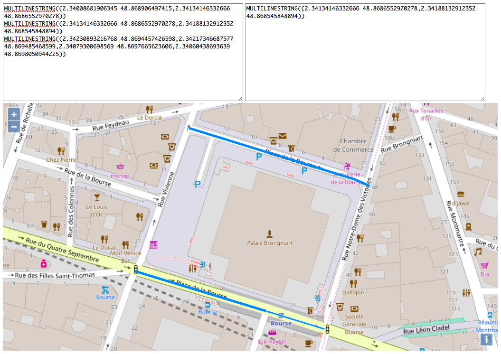

Geo Feature Examiner
====================

This tool renders arbitrary Well-Known Text (WKT) geographic features on a map.
Those features can be clicked on to get their WKT representation.

Say for example you have a dozen geometries corresponding to streets. You want
to find the geometry that represents a specific street. Paste the WKT for all
geometries, and click on the one you want. Its geometry will be displayed for
easy copying and referencing.

## Screenshot

## Usage
Enter WKT-formatted geometries in the left textarea. Multiple geometries can be
added, with each one on a separate line. Lines not containing WKT will cause
rendering to fail. Input geometries must be projected with EPSG:4326 (WSG84).

Inspect the rendered geometries on the map. Clicking on a geometry will display
its WKT representation in the textarea on the right.

## License
Copyright © 2017 Teddy Wing & af83 SAS. Licensed under the GNU GPLv3+ (see the
included COPYING file).
